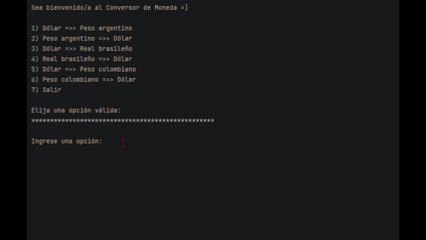

<h1 align="center">Challenge Conversor de Monedas</h1>

  

Proyecto de <strong>Conversor de Monedas en Java</strong> para convertir valores a diferentes monedas utilizando tasas de cambio actualizadas desde una API externa.

El programa obtiene los datos desde <strong>ExchangeRate API</strong>, procesa la respuesta en formato <strong>JSON</strong> usando la biblioteca <strong>Gson</strong> y permite al usuario interactuar mediante un menú en consola.

Este proyecto fue desarrollado como parte del Challenge de Programación <strong>"Practicando con Java: Challenge Conversor de Monedas"</strong> del programa <strong>Oracle Next Education (ONE)</strong> en colaboración con <strong>Alura Latam</strong>.

<h3 align="center">✅ Proyecto completado ✅</h3>

## Indice

- [Funcionalidades del proyecto](#funcionalidades-del-proyecto)
- [Acceso y ejecucion del proyecto](#acceso-y-ejecucion-del-proyecto)
- [Tecnologias utilizadas](#tecnologias-utilizadas)
- [API utilizada](#api-utilizada)
- [Ejemplo de uso](#ejemplo-de-uso)
- [Autor](#autor)

## ⚙️ Funcionalidades del proyecto

El conversor permite realizar las siguientes conversiones:

1. Dólar (USD) → Peso argentino (ARS)  
2. Peso argentino (ARS) → Dólar (USD)  
3. Dólar (USD) → Real brasileño (BRL)  
4. Real brasileño (BRL) → Dólar (USD)  
5. Dólar (USD) → Peso colombiano (COP)  
6. Peso colombiano (COP) → Dólar (USD)  

El usuario puede ingresar el valor a convertir y el programa calcula automáticamente el resultado usando la tasa actual.

## 📁 Acceso y ejecucion del proyecto

1. Descargue o clone el repositorio.  
2. Abra el proyecto en su IDE de preferencia.  
3. Ejecute la clase principal.  
4. Elija una opción del menú y escriba el valor a convertir.  

## 🛠 Tecnologias utilizadas

- ☕ Java  
- 📦 Gson  
- 🌐 ExchangeRate API  
- 🔗 HttpClient  
- 💻 IntelliJ IDEA  
- 🗂 Git  
- 🐙 GitHub  

## 🌐 API utilizada

- ExchangeRate API

https://www.exchangerate-api.com/

## 📌 Ejemplo de uso

  

## ✍️ Autor

Proyecto desarrollado por <strong>Arely Hernández</strong>